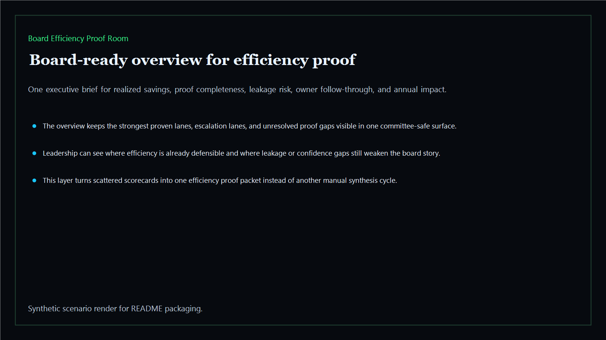
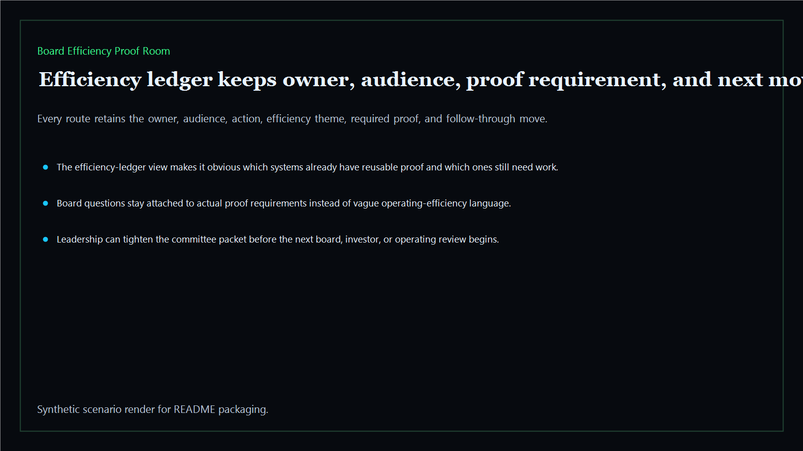
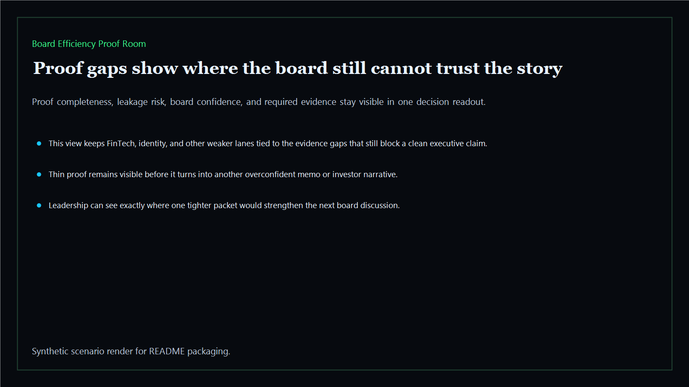
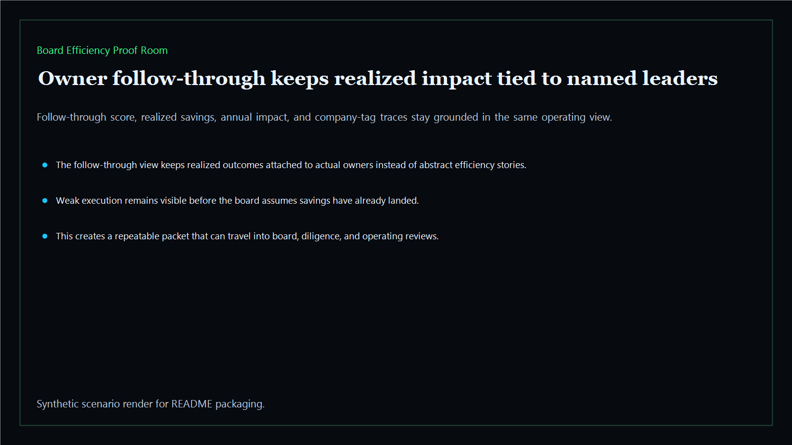

# Board Efficiency Proof Room

Board-ready efficiency proof room for realized savings evidence, owner follow-through, and unresolved operating leakage across the executive estate.

- Live: `https://efficiency.kineticgain.com/`
- Repo: `mizcausevic-dev/board-efficiency-proof-room`

## Why this matters

Leaders need more than an approved savings plan. They need one proof room that shows what landed, who followed through, where leakage remains, and which efficiency claims are still too thin for the board to trust.

## What it includes

- TypeScript executive-intelligence surface for efficiency proof with modeled realized savings, follow-through quality, leakage risk, owner clarity, and board defensibility signals
- synthetic executive lanes across AI, identity, revenue, FinTech, biotech, procurement, and public-sector readiness
- reusable outputs for efficiency ledgers, proof-gap packets, owner follow-through views, and board-ready leakage maps
- prerendered static site, JSON payloads, screenshots, and docs

## Product depth

This is an efficiency proof room, not a savings-plan landing page. It helps leaders prove which savings actually landed, which owners followed through, where leakage remains, and which efficiency claims still need evidence before they are safe to repeat to a board, investor, or finance committee.

- **Buyer value:** separates realized savings from optimistic savings stories by tying impact to named owners, proof completeness, leakage risk, and next actions.
- **Technical proof:** uses typed fixtures, deterministic scoring, JSON APIs, CLI output, static HTML, screenshots, and tests from the same packet.
- **GTM story:** supports cost-takeout, margin expansion, diligence, and operating-review conversations without relying on vague transformation language.

## What these repos have in common

The executive-intelligence repos turn fragmented systems work into buyer-readable operating evidence. Each one keeps a clear product promise, a scored model, reproducible artifacts, and direct links back to the broader Kinetic Gain portfolio so the public estate reads as a connected suite.

- **Board-ready language:** executives can see the decision, risk, value, owner, and next move without parsing raw technical systems.
- **Operator-readable proof:** technical reviewers can inspect fixtures, scoring, routes, tests, APIs, and rendered outputs.
- **Portfolio signal:** every proof surface strengthens the map at `https://portfolio.kineticgain.com/` and the suite narrative at `https://suite.kineticgain.com/`.

## Operating workflow

1. Load the modeled efficiency proof packet from `fixtures/`.
2. Score each lane for realized savings, proof completeness, leakage risk, owner follow-through, and board confidence.
3. Render the overview, efficiency ledger, proof-gap view, owner follow-through route, JSON payloads, and screenshots from the same source.
4. Publish the static site with deploy-time marker checks for product depth, portfolio links, and repo identity.

## Routes

- `/`
- `/efficiency-ledger`
- `/proof-gaps`
- `/owner-follow-through`
- `/verification`
- `/docs`

## Local run

```bash
cd board-efficiency-proof-room
npm install
npm run verify
npm run prerender
npm run render:assets
```

## CLI

```bash
npx board-efficiency-proof-room fixtures/board-efficiency-proof-room.json --format summary
npx board-efficiency-proof-room fixtures/board-efficiency-proof-room-clean.json --format json
```

## Docs

- [Architecture](docs/architecture.md)
- [Origin](docs/ORIGIN.md)
- [Kinetic Gain Embedded](docs/KINETIC_GAIN_EMBEDDED.md)

## Screenshots






